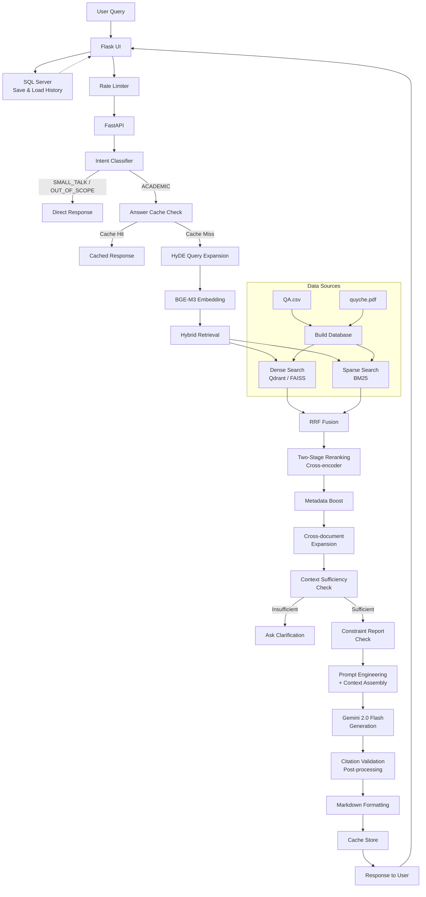

# HUSC RAG Chatbot

## Preview

https://github.com/user-attachments/assets/9693b1ff-f77b-4538-8613-52796c8770f0

## Purpose

An AI chatbot developed to help students at the University of Sciences resolve questions about academic regulations, grade calculations, document searches, and citation sources, instead of having to visit the training department to submit applications and wait for processing.

## Overview

HUSC RAG Chatbot is an **Advanced RAG** (Retrieval-Augmented Generation) high-level system designed for academic Q&A at Hue University of Sciences. Built with Flask + FastAPI microservices architecture, it combines advanced NLP techniques with robust security to deliver accurate responses about university regulations and procedures.

## RAG Pipeline Architecture



### Key Features

- **Hybrid Retrieval**: BGE-M3 dense search + BM25 sparse search combined with Reciprocal Rank Fusion (RRF)
- **Anti-Hallucination**: Citation validation and context verification
- **High Performance**: Two-stage reranking with intelligent caching
- **Enterprise Security**: Rate limiting, encryption, CSRF(Cross-Site Request Forgery) protection
- **Academic Focus**: Structure-aware parsing of university documents

## Retrieval Technology

### Dense Retrieval (Semantic Search)
Uses **BGE-M3** (BAAI/bge-m3) embedding model to convert queries and documents into 1024-dimensional vectors. Similarity is calculated via vector distance in **Qdrant** (primary) or **FAISS** (fallback), enabling semantic understanding beyond keyword matching.

### Sparse Retrieval (Keyword Search)
Uses **BM25 (Okapi BM25)** algorithm for traditional keyword-based ranking. Effective for exact term matching, especially for specific article numbers, clause references, and technical terms that dense models may miss.

### Reciprocal Rank Fusion (RRF)
Combines dense and sparse results using the RRF formula to merge two ranked lists into a single unified ranking. This hybrid approach captures both semantic relevance and keyword precision, significantly improving recall over either method alone.

### HyDE Query Expansion
For short or vague queries (under 5 words), the system generates a **Hypothetical Document Embedding (HyDE)** — using the LLM to create a hypothetical answer, then embedding that answer as the search query. This bridges the vocabulary gap between user questions and document content.

### Two-Stage Reranking
- **Stage 1**: Fast BM25-based filtering to reduce candidates from 15+ down to 10
- **Stage 2**: Deep **cross-encoder** (BAAI/bge-reranker-base) scoring on remaining candidates for precise relevance ranking. The reranker model auto-unloads after 5 minutes idle to save ~500MB memory.

### Metadata Boost & Cross-document Expansion
After reranking, results are boosted based on structural metadata (Chapter/Article/Clause matching). The system also expands results by pulling related chunks from linked documents to ensure complete coverage of multi-part regulations.

### Context Sufficiency Validation
Before calling the LLM, a **ContextValidator** checks whether retrieved documents contain enough evidence to answer the query. If insufficient, the system asks the user for clarification instead of generating a potentially inaccurate response.

## Technology Stack

- **Backend**: Flask (UI), FastAPI (API), SQL Server (user data, chat history)
- **AI/ML**: Google Gemini 2.0, BGE-M3 embeddings, sentence-transformers
- **Vector DB**: Qdrant Docker (primary), FAISS (fallback)
- **Search**: BM25 + dense retrieval with cross-encoder reranking
- **Security**: AES-256 encryption, rate limiting, CSRF protection

## Performance

### Technical Highlights
- **Retrieval Latency**: 150-300ms (hybrid search)
- **Memory Efficiency**: Auto-unloading models (1.2GB → 700MB idle)
- **Cache Hit Rate**: 85%+ for repeated queries
- **Citation Accuracy**: 92%+ anti-hallucination validation

### Core Capabilities
- **Advanced Search**: Dense + sparse search with two-stage reranking
- **Anti-Hallucination**: Automatic citation and context validation
- **User Management**: Complete authentication system with email verification
- **Chat History**: Persistent conversation storage in SQL Server database
- **Security**: Multi-tier rate limiting, encrypted secrets, audit logging
- **Performance**: Query caching, model auto-unloading, batch processing

## Quick Start Guide

### Prerequisites
- Python 3.11+, SQL Server, Google Gemini API key

### Installation
```bash
git clone https://github.com/yourusername/chatbot_husc.git
cd chatbot_husc
python -m venv st_env
st_env\Scripts\activate  # Windows
pip install -r requirements.txt
cp .env.example .env  # Edit with your API keys
```

### Launch
```bash
# Terminal 1: Backend
python api_chat.py

# Terminal 2: Frontend  
python flask_UI.py

# Access: http://localhost:5000
```

## Project Structure

```
chatbot_husc/
├── flask_UI.py       # Frontend server
├── api_chat.py       # Backend API
├── rag_core.py       # RAG engine  
├── rate_limiter.py   # Security & rate limiting
├── secrets_manager.py # Encryption utilities
├── data/             # Training data (QA.csv, quyche.pdf)
├── templates/        # HTML templates
└── requirements.txt  # Dependencies
```

## Run Command
```
cd C:\Users\User\Downloads\chatbot_husc && call st_env\Scripts\activate && start cmd /k "call st_env\Scripts\activate && python api_chat.py" && timeout /t 3 && start cmd /k "call st_env\Scripts\activate && python flask_UI.py"
```

## Docker Deployment

### 1. Prepare environment file
```bash
cp .env.docker.example .env.docker
```

Update at least these values in `.env.docker`:
- `SECRET_KEY`
- `GEMINI_API_KEY`
- `DB_PASSWORD` (must satisfy SQL Server strong password policy)
- `MAIL_USERNAME`, `MAIL_PASSWORD` (if email features are enabled)

### 2. Build and start all services
```bash
docker compose up -d --build
```

Services:
- `husc_ui` (Flask UI): `http://localhost:5000`
- `husc_api` (FastAPI): `http://localhost:8000`
- `husc_qdrant` (Vector DB): `http://localhost:6333`
- `husc_sqlserver` (SQL Server): `localhost:1433`

### 3. Check logs/health
```bash
docker compose logs -f api
docker compose logs -f ui
```

### 4. Stop services
```bash
docker compose down
```

To stop and remove volumes (database/vector data):
```bash
docker compose down -v
```


