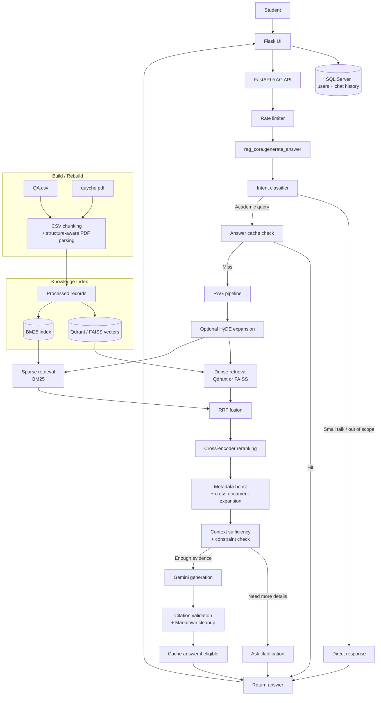

# HUSC RAG Chatbot

AI academic assistant for Hue University of Sciences students. The system helps students ask questions about academic regulations, credits, GPA, scholarships, graduation conditions, and student procedures by combining a web chatbot with a retrieval-augmented generation pipeline.

## Why This Project Matters

Students often need to search long regulation documents or contact academic offices for procedural questions. This project turns official handbook content and curated Q&A data into a searchable chatbot that can return grounded answers with citation-aware context.

## Highlights

- Hybrid RAG pipeline using dense vector search and BM25 keyword retrieval.
- Structure-aware PDF parsing for Vietnamese academic regulations by chapter, section, article, clause, and page.
- Citation validation and context sufficiency checks to reduce hallucination.
- Flask web UI with login, email OTP registration, password reset, sessions, and chat history.
- FastAPI RAG service separated from the UI service for cleaner deployment.
- SQL Server for users and chat history.
- Qdrant vector database in Docker, with FAISS as a local alternative.
- Rate limiting, secret handling, answer cache, and model memory optimization.
- Metrics suite for retrieval, generation, citation, intent classification, and performance.

## Runtime Flow

1. User signs in through the Flask web UI.
2. The UI saves chat history to SQL Server.
3. The UI sends chat requests to the FastAPI RAG service.
4. FastAPI applies rate limiting, waits for RAG startup if needed, then calls `rag_core.generate_answer()`.
5. `rag_core` classifies intent. Small talk and out-of-scope questions return direct responses.
6. Academic questions use answer cache when eligible; otherwise they go through optional HyDE expansion, hybrid retrieval, reranking, metadata boost, context checks, Gemini generation, citation validation, and Markdown cleanup.
7. The UI renders the final answer and stores both user and bot messages in SQL Server.

## Architecture



The diagram separates **runtime retrieval** from **database build/rebuild**. `QA.csv` and `quyche.pdf` are parsed during rebuild to create records, BM25 data, and vector indexes. User questions are then served from those prepared indexes.

## Tech Stack

| Area | Technologies |
| --- | --- |
| UI and auth | Flask, Jinja templates, Flask-Mail, Werkzeug security |
| API | FastAPI, Uvicorn, Pydantic |
| RAG | SentenceTransformers, BGE-M3, BM25, CrossEncoder reranker |
| LLM | Google Gemini, default model `gemini-2.5-flash` via `GEMINI_MODEL` |
| Vector database | Qdrant by default, FAISS as a local alternative |
| Database | SQL Server, pyodbc |
| Data processing | pandas, PyMuPDF/PyPDF2, tiktoken |
| Deployment | Docker, Docker Compose |
| Evaluation | Custom retrieval, generation, citation, intent, and performance metrics |

## Repository Structure

```text
chatbot_husc/
|-- api_chat.py              # FastAPI service for RAG/chat endpoints
|-- flask_UI.py              # Flask web app, auth, sessions, chat history
|-- rag_core.py              # Core RAG engine
|-- intent_classifier.py     # Rule-based intent classifier
|-- rate_limiter.py          # In-memory rate limiter
|-- secrets_manager.py       # Secret loading and optional encryption helpers
|-- docker-compose.yml       # Docker deployment for UI, API, SQL Server, Qdrant
|-- Dockerfile.api           # FastAPI + ML/RAG image
|-- Dockerfile.ui            # Flask UI image
|-- data/
|   |-- QA.csv               # Curated academic Q&A pairs
|   `-- quyche.pdf           # Handbook/regulation source
|-- templates/               # Flask HTML templates
|-- static/                  # CSS and image assets
|-- metrics/                 # Evaluation scripts
`-- test_citation_accuracy.py
```

## Main Features

### RAG and Retrieval

- Builds searchable records from CSV Q&A and PDF regulations.
- Parses PDF structure into document families, page ranges, chapters, sections, articles, and clauses.
- Combines dense and sparse retrieval with Reciprocal Rank Fusion.
- Uses cross-encoder reranking and metadata boosts for article/clause-specific queries.
- Adds cross-document context when a regulation references another article.
- Uses optional HyDE query expansion for short or vague academic queries.

### Answer Quality and Safety

- Checks whether retrieved context is sufficient before calling the LLM.
- Asks clarification when an article number appears in multiple document families.
- Checks selected apply/exclusion constraints for decision-style scholarship and graduation questions.
- Validates generated citations against retrieved context.
- Avoids fabricating article/chapter numbers when evidence is missing.
- Supports Markdown tables and LaTeX formulas in chatbot answers.

### Product Experience

- Login, registration, email OTP verification, password reset.
- Persistent chat history per user.
- Admin-only database rebuild action.
- API connect/disconnect controls from the UI.
- Mobile-responsive chatbot interface.

## Prerequisites

For Docker setup:

- Docker Desktop or Docker Engine with Compose v2.
- Google Gemini API key.

For local setup:

- Python 3.11.
- SQL Server.
- ODBC Driver 17 or 18 for SQL Server.
- Google Gemini API key.
- Optional: Qdrant running locally if `VECTOR_DB_TYPE=qdrant`.

## Quick Start With Docker

Docker is the recommended way to run the full product because it starts the UI, API, SQL Server, and Qdrant together.

1. Clone the repository.

```bash
git clone https://github.com/Nhatnguyn1710/chatbot_husc.git
cd chatbot_husc
```

2. Create the environment file.

```bash
cp .env.docker.example .env
```

3. Edit `.env`.

Required values:

```env
SECRET_KEY=replace-with-a-long-random-secret
GEMINI_API_KEY=your-gemini-api-key
DB_PASSWORD=ChangeMe_Strong@Pass123
```

Optional email values for OTP flows:

```env
MAIL_USERNAME=your-email@gmail.com
MAIL_PASSWORD=your-app-password
```

4. Start all services.

```bash
docker compose up -d --build
```

The first build can take a while because the API image installs ML dependencies and downloads embedding models on first use.

The API starts the RAG initialization in the background. On the first run, give the API time to load or rebuild indexes before sending chat requests.

5. Open the app.

```text
http://localhost:5000
```

Useful service URLs:

```text
Flask UI:      http://localhost:5000
FastAPI:       http://localhost:8000
Qdrant:        http://localhost:6333
SQL Server:    localhost:1433
```

6. Check health and logs.

```bash
docker compose ps
docker compose logs -f api
docker compose logs -f ui
curl http://localhost:8000/status
```

7. Stop services.

```bash
docker compose down
```

Remove volumes if you want to reset database/vector data:

```bash
docker compose down -v
```

## Local Development Setup

1. Create a virtual environment.

```bash
python -m venv st_env
st_env\Scripts\activate
```

2. Install dependencies.

```bash
pip install -r requirements.txt
```

3. Create `.env`.

```bash
copy .env.example .env
```

4. Edit `.env` for your local machine.

Minimum values:

```env
SECRET_KEY=replace-with-a-long-random-secret
GEMINI_API_KEY=your-gemini-api-key
FASTAPI_BASE_URL=http://127.0.0.1:8000

DB_DRIVER=ODBC Driver 17 for SQL Server
DB_SERVER=MSI
DB_NAME=ChatbotDB
DB_TRUSTED_CONNECTION=true
DB_AUTO_CREATE=true

CSV_FILE=data/QA.csv
PDF_FILE=data/quyche.pdf
VECTOR_DB_TYPE=qdrant
QDRANT_URL=http://127.0.0.1:6333
```

If you do not run Qdrant locally, set:

```env
VECTOR_DB_TYPE=faiss
```

5. Start the FastAPI service.

```bash
python api_chat.py
```

6. Start the Flask UI in another terminal.

```bash
python flask_UI.py
```

7. Open:

```text
http://localhost:5000
```

## Rebuild the RAG Database

From the UI:

- Log in as an admin user configured with `ADMIN_USER` and `ADMIN_PASSWORD`.
- Click the rebuild database action in the sidebar.

From the API:

```bash
curl -X POST http://localhost:8000/rebuild_db
```

The rebuild reads:

```text
data/QA.csv
data/quyche.pdf
```

and creates records, BM25 data, and Qdrant/FAISS vector indexes. Generated index files such as `.pkl` or `.faiss` are intentionally ignored by Git.

## Evaluation

Run all available metrics:

```bash
python metrics/run_metrics.py
```

Run selected metrics:

```bash
python metrics/run_metrics.py --only intent retrieval
```

Run citation regression checks:

```bash
python test_citation_accuracy.py
```

Some generation, citation, and performance metrics require a working Gemini API key and a ready vector database.

## Security Notes

- Never commit `.env`, `.env.txt`, API keys, password files, or the `secrets/` directory.
- The repository includes `.env.example` and `.env.docker.example` only as templates.
- If an API key was ever pushed publicly, revoke and rotate it before redeploying.
- Generated caches, logs, local virtual environments, and vector indexes are ignored.

## Production Deployment Notes

For a public deployment, use the Docker setup as the base and add the following operational safeguards:

- Put the Flask UI behind a reverse proxy such as Nginx or a cloud load balancer.
- Serve traffic over HTTPS and set `SESSION_COOKIE_SECURE=true`.
- Use strong values for `SECRET_KEY`, `DB_PASSWORD`, `ADMIN_PASSWORD`, and SMTP credentials.
- Store secrets in environment variables or a secret manager, not in source code.
- Use persistent volumes for SQL Server and Qdrant data.
- Restrict direct public access to SQL Server, Qdrant, and the FastAPI service when possible.
- Rotate the Gemini API key if it was ever exposed.
- Rebuild the RAG database after changing `data/QA.csv` or `data/quyche.pdf`.

## Current Limitations

- The RAG service depends on large ML packages, so first setup can be slow.
- Email OTP requires a configured SMTP account or Gmail app password.
- SQL Server is required for the full authentication and chat history flow.
- Local FAISS mode is useful for development, while Docker Compose defaults to Qdrant.

## Author

Developed by Nhat Nguyen as a full-stack AI/RAG academic assistant project for HUSC student support.
