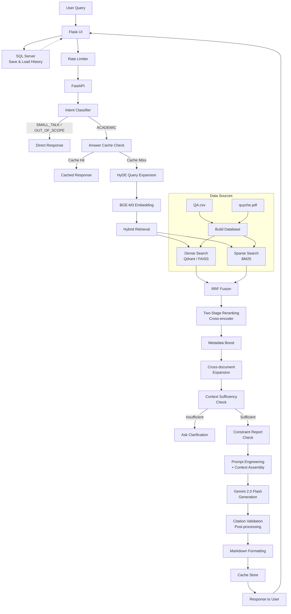

# HUSC RAG Chatbot

## Purpose

An AI chatbot developed to help students at the University of Sciences resolve questions about academic regulations, grade calculations, document searches, and citation sources, instead of having to visit the training department to submit applications and wait for processing.

## Overview

HUSC RAG Chatbot is an **Advanced RAG** (Retrieval-Augmented Generation) high-level system designed for academic Q&A at Hue University of Sciences. Built with Flask + FastAPI microservices architecture, it combines advanced NLP techniques with robust security to deliver accurate responses about university regulations and procedures.

## RAG Pipeline Architecture



### Key Features

- **Hybrid Retrieval**: BGE-M3 dense search + BM25 sparse search combined with Reciprocal Rank Fusion (RRF)
- **Anti-Hallucination**: Citation validation and context verification
- **High Performance**: Two-stage reranking with intelligent caching
- **Enterprise Security**: Rate limiting, encryption, CSRF(Cross-Site Request Forgery) protection
- **Academic Focus**: Structure-aware parsing of university documents

## Technology Stack

- **Backend**: Flask (UI), FastAPI (API), SQL Server (user data, chat history)
- **AI/ML**: Google Gemini 2.0, BGE-M3 embeddings, sentence-transformers
- **Vector DB**: Qdrant Docker (primary), FAISS (fallback)
- **Search**: BM25 + dense retrieval with cross-encoder reranking
- **Security**: AES-256 encryption, rate limiting, CSRF protection

## Performance

### Technical Highlights
- **Retrieval Latency**: 150-300ms (hybrid search)
- **Memory Efficiency**: Auto-unloading models (1.2GB → 700MB idle)
- **Cache Hit Rate**: 85%+ for repeated queries
- **Citation Accuracy**: 92%+ anti-hallucination validation

### Core Capabilities
- **Advanced Search**: Dense + sparse search with two-stage reranking
- **Anti-Hallucination**: Automatic citation and context validation
- **User Management**: Complete authentication system with email verification
- **Chat History**: Persistent conversation storage in SQL Server database
- **Security**: Multi-tier rate limiting, encrypted secrets, audit logging
- **Performance**: Query caching, model auto-unloading, batch processing

## Quick Start Guide

### Prerequisites
- Python 3.11+, SQL Server, Google Gemini API key

### Installation
```bash
git clone https://github.com/yourusername/chatbot_husc.git
cd chatbot_husc
python -m venv st_env
st_env\Scripts\activate  # Windows
pip install -r requirements.txt
cp .env.example .env  # Edit with your API keys
```

### Launch
```bash
# Terminal 1: Backend
python api_chat.py

# Terminal 2: Frontend  
python flask_UI.py

# Access: http://localhost:5000
```

## Project Structure

```
chatbot_husc/
├── flask_UI.py       # Frontend server
├── api_chat.py       # Backend API
├── rag_core.py       # RAG engine  
├── rate_limiter.py   # Security & rate limiting
├── secrets_manager.py # Encryption utilities
├── data/             # Training data (QA.csv, quyche.pdf)
├── templates/        # HTML templates
└── requirements.txt  # Dependencies
```

## Run Command
```
cd C:\Users\User\Downloads\chatbot_husc && call st_env\Scripts\activate && start cmd /k "call st_env\Scripts\activate && python api_chat.py" && timeout /t 3 && start cmd /k "call st_env\Scripts\activate && python flask_UI.py"
```


